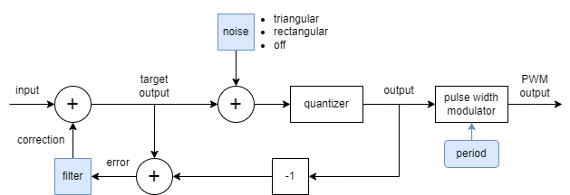

<!---

This file is used to generate your project datasheet. Please fill in the information below and delete any unused
sections.

You can also include images in this folder and reference them in the markdown. Each image must be less than
512 kb in size, and the combined size of all images must be less than 1 MB.
-->

## How it works

The aim of this project is to test if it is possible to output 16 bit audio using a single digital output from a pure digital Tiny Tapeout design.
For this purpose, it implements a noise-shaping delta-sigma converter that feeds into a pulse width modulator to create the digital output signal.

The design can be driven with sample data (eg using the PIO functionality in the RP2040/RP2350 microcontroller on the demo board). There is also a built-in triangle wave generator for testing without needing to feed sample data.

### Operating principle

Assume that we want to output an audio signal at 48 kHz from a design that is clocked at 50 MHz, using single digital output pin fed by a flip-flop. That gives us about 1040 cycles to output each sample.
(This design can go up to 66.66 MHz, but the main target is to get a working output at 50 MHz).
If we output each sample by controlling the average over a 1040 cycle period, we get a little more than 10 bits of resolution. This can for instance be done with pulse width modulation (PWM).

One way to look at it is that we are taking the original unquantized output signal and adding noise to it so that it becomes a quantized signal with a resolution that can actually be output.
The target can be a one bit signal sampled at 50 MHz, or a signal with higher bit depth and lower frequency output using PWM for instance (we will aim for the latter). 
There is a least amount of noise we need to add to make the output signal quantized, but the noise doesn't have to be added equally across the frequency spectrum.
This design uses a noise shaping sigma-delta modulator to shape the quantization noise to put most of it above the audible frequency range.

#### Example
Let's use a 4th order filter (the highest order that seems to be useful with a clock frequency of 50 MHz in this setup).
We will consider two kinds of error:

* The _quantization error_ is the difference between the target output and the actual output
* The _quantization noise_ is the difference between the input signal and the actual output

(see the figure at the top.)
At each sample, we will make a quantization error.
Assume (for the purpose of illustration) that we make a quantization error of 1 in the first sample.
The 4th order filter will add corrections to the following samples 4 samples, with values `-4, 6, -4, 1`.
Taken together, the sequence of disturbances caused by the first quantization error of 1 becomes

	1, -4, 6, -4, 1

where the the first 1 comes from the quantization noise in the first sample, and the rest is corrections added by the filter.

This sequence is the impulse response of a filter `(1 - z^-1)^4` with 4 zeros at `z = 1` (zero frequency), and has very little low frequency content.
Adding the corrections will add more energy to the quantization noise (in this case, the variance will be 70x higher, `1^2+4^2+6^2+4^2+1^2 = 70`), but the low frequency components of the quantization noise will be greatly reduced by the corrections.

The corrections can not be applied exactly because there will be quantization errors in the following samples as well, but these errors can be corrected in the same way.
The quantization error is bounded, and the bound doesn't grow due to the corrections, so the corrections will be bounded as well.
If the quantizer rounds the output to the nearest integer, the magnitude of the quantization error is `<= 0.5`, and the 4th order filter adds noise of up to `+- 7.5` output steps to each sample.

The output of the delta-sigma modulator is fed to a pulse width modulator with programmable period. The PWM period sets the range of the output signal.
We have to make sure that the period is long enough to fit the variation of both the quantization noise and the input signal.
Setting the PWM period is a tradeoff between output resolution and range on one hand, and output frequency on the other:

* If the magnitude of the of the input signal becomes too low compared to the noise, the noise will dominate and the effective resolution will suffer.
* The longer we make the PWM period, the lower the filter's sampling frequency becomes, moving more of the high frequency quantization noise into the audible range.

In this case, a period of 47 cycles may be appropriate, to allow an output swing of 0-31 from the input signal combined with 0-14 (if we add 7.5) for the noise. 45 cycles would be enough for this purpose, but since rising and falling edges may propagate at different speeds throught the TT multiplexer, we also want to avoid hitting 0% or 100% duty cycle to keep one rising and one falling edge per pulse in the output signal.

#### Adding additional noise to the quantization error
The default behavior is to let the quantizer calculate the output by rounding the target output to the nearest integer.
The hope is that the quantization error should behave as white noise. Then, even if some of it feeds through as audible noise at (higher) audible frequencies, it is just a little added noise.
Round to nearest quantization produces the smallest quantization error, but the statistical properties may be unpredictable.
If the quantization error ends up including prominent frequency components that change with the input signal, it could create objectionable artifacts in some cases.

TODO: rectangular and triangular noise.

### Interface

The design contains a number of 16 bit registers.
To write to one,

- Make sure that `data_part_in = 1`
- Set `data_in[7:0]` to the low byte
- Set `data_part_in = 0`
- Wait at least 3 cycles for the low byte to be buffered
- Set `data_in[7:0]` to the high byte
- Set `addr[2:0]` to the desired register address
- Set `data_part_in = 1`
- Wait 3 cycles for the register to be written

Registers:

| Register | Field            | Name              | Description            |
|----------|------------------|-------------------|------------------------|
| 0        | `reg0[15:0]`     | `u`               | input signal           |
| 1        | `reg1[6:0]`      | `period_minus_1`  |                        |
|          | `reg1[10:8]`     | `u_rshift`        | input shift            |
|          | `reg1[12]`       | `ddr_en`          | enable DDR mode for PWM|
|          | `reg1[12]`       | `reset_lfsr`      | for testing            |
|          | `reg1[13]`       | `force_err_0`     | for testing            |
|          | `reg1[15:14]`    | `pwm_mode`        |                        |
| 2        | `reg2[3:2]`      | `filter_choice`   |                        |
|          | `reg2[11:8]`     | `n_decorrelate`   | noise decorrelation    |
|          | `reg2[15:14]`    | `noise_mode`      |                        |
| 3        | `reg3[13:0]`     | `delta_u`         | for triangle generator |

### Other pins

- `sample_toggle_out` toggles each time `pulse_divider+1` PWM pulses have been output. This can be used to time transfers of new input signal values `u`.
- `echo_out` echoes the value of `echo_in`. This could be used to test how a signal that is routed next to `dac_out` in the TT chip influences the noise performance.

## How to test

## External hardware

This project needs some way to use the `dac_out` output signal, and preferably to low pass filter it to filter out the high frequency noise.
Mike's audio Pmod (https://github.com/MichaelBell/tt-audio-pmod) can be used to convert the output to an audio signal for listening and includes a low pass filter to reduce frequencies above the audible range.
